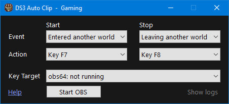

# DS3 Auto Clip

Auto Clip is a simple tool to automatically control OBS to record your online adventures.

## Installation

> DS3 Auto Clip requires .net Framework 4.8 to run. This is included by default in Windows 10 & 11, but you may need to install it on older versions of Windows.

Download the application [here]().

## How it works

Auto Clip directly reads the memory of Dark Souls III to detect whether the player is in another world as a summon or dark spirit. It then uses this to automatically start and stop recording with OBS Studio by sending the keyboard shortcuts your configured.

This allows you to play online, while Auto Clip controls OBS in the background to record your play sessions. By default, it will start recording when you enter another world (as a summon or dark spirit) and stop recording when you leave the world (either).

## Usage

By default, Auto Clip will start recording with F7 when you enter another world and stop recording with F8 when you leave the world.

OBS needs to be configured to start/stop recording with these shortcuts. You can do this by going to `File -> Settings -> Hotkeys` in OBS Studio and setting the `Start Recording` and `Stop Recording` shortcuts to F7 and F8 respectively.

Of course, you also need to setup the actual game recording in OBS Studio. There are many [guides](https://obsproject.com/kb/game-capture-setup-guide) explaining this, so I won't repeat them here. I recommend testing the recording setup in OBS Studio by itself before using Auto Clip.

After everything is setup, you just need to run Auto Clip and OBS Studio in the background while playing Dark Souls III. Auto Clip will automatically start and stop recording based on your online activity. Enjoy gaming and recording!

### Events

- **Loading another world**: This event occurs at the start of the loading screen when your game loads the world your invading or are summoned to.
- **Entered another world**: This event occurs at the end of the loading screen when you've successfully entered another world.
- **Leaving another world**: This event occurs at the start of the loading screen when you're leaving the world you invaded or were summoned to. When your game crashes or your quit out, this event will also be triggered.
- **Entered own world**: This event occurs at the end of the loading screen when you've successfully returned to your own world.

### Actions

- **None**: Do nothing.
- **Key F2** to **Key F12**: Simulate a pressing the select FN key. The key press is only sent to the selected key target process.

### Key Target

Simulated key presses are sent to the selected process. By default, this is OBS Studio, but you can change it to any other process you want. No other process (e.g. Dark Souls III) will receive the key press.

There's also a handy *Start OBS* button to start OBS Studio if it's not running.

## FAQ

### Can Auto Clip be used with other recording software?

Yes. Auto Clip only sends out keyboard presses, so any software can pick up on them. You just need to configure our recording software to start/stop recording with keyboard shortcuts Auto Clip supports.

### Will this get me banned?

No. Auto Clip does not modify the game or its memory in any way, it only reads the memory of the game to detect events. So there is nothing for DS3's anti-cheat to detect.

### Can Auto Clip be used to cheat?

No. Auto Clip does not change the game's memory, which makes most forms of cheating impossible. You also cannot gain any addition information about the game from Auto Clip, because it only reads information from memory that is displayed in game (e.g. what type of phantom am _I_, what area am _I_ in, what are _my_ stats).

### Is Auto Clip secure?

Yes. Auto Clip does not connect to the internet, change files on your computer, or do anything else that could be considered malicious. It only reads the memory of Dark Souls III and sends keyboard shortcuts to OBS Studio.

But no need to trust me. You can check the source code yourself and build the application yourself.
